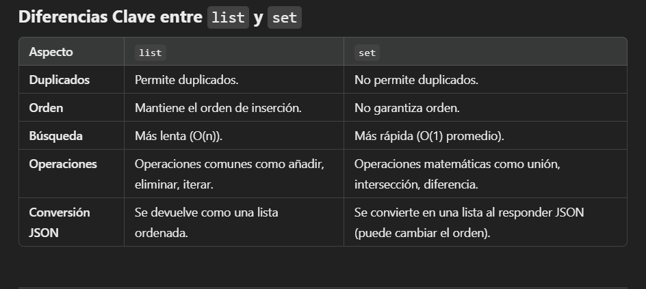

***Field se importa directamente desde Pydantic.***

body-Fields

Cuando definimos un modelo item, se puede utilizar el fiel para establecer restricciones y descripciones en sus atributos.

Como utilizarlo ?? ejemplo -->

si tengo in item : 


```python
from pydantic import BaseModel, Field

Class Item(BaseModel):
    name: str
    descripcion: str | none = field(
        default= None, title = " descriocion del item", max_length=30
    )

´´´
En este caso estoy controlando aspectos como valores por defecto, restricciones y metadatos.

Body-Nested Models 


diferencia entre usar el set y list 




